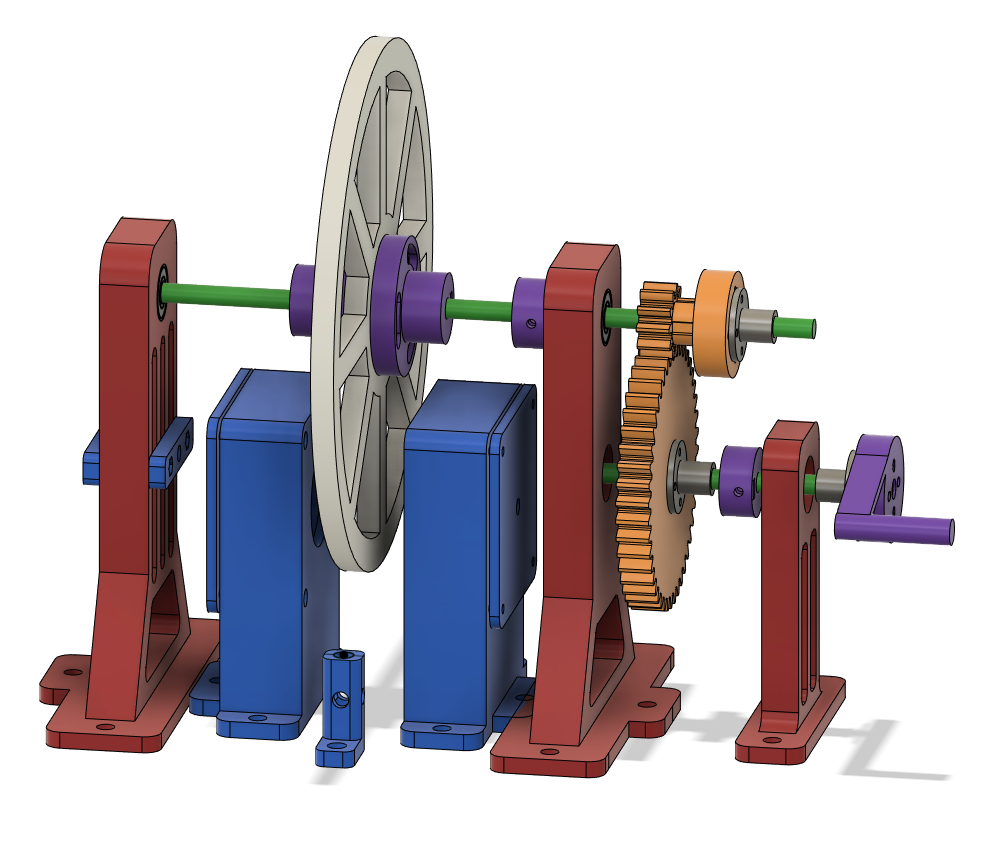
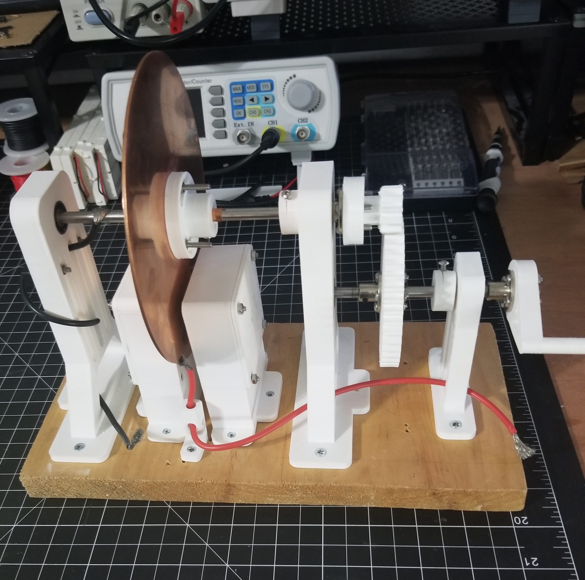

# faraday-disk

A Faraday disk built to learn about electromagnetism and early generators.

Write up with some concepts, equations, and math is located in [faraday-disk.md](faraday-disk.md)

## Performance

At around 200rpm, the generator produces voltage of around 1.9-2.1mV and current of 0.1μA.
Theoretically (no losses), with this design I should have gotten 0.18V and 0.8007A.

As expected, this generator performed far from ideally.

I think most of the loss comes from brush contacts, oxidation on the copper disk,
and the effects of eddy currents.

## Parts List

- 6mm (606) bearings (x4)
- 6mm axle, ~120mm
- 6mm axle, ~180mm
- Stranded wire for brushes
- 40x20mm neodymium magnets (x2)
- 3D printed parts
  - [cad/axle-2-support.stl](cad/axle-2-support.stl)
  - [cad/axle-cap](cad/axle-cap.stl) (x2)
  - [cad/brush-mount-bolt.stl](cad/brush-mount-bolt.stl)
  - [cad/brush-mount-bottom.stl](cad/brush-mount-bottom.stl)
  - [cad/brush-mount-nut.stl](cad/brush-mount-nut.stl)
  - [cad/coupler-bolt.stl](cad/coupler-bolt.stl) (x2)
  - [cad/hand-crank.stl](cad/hand-crank.stl)
  - [cad/magnet-brush-mount-large-lid.stl](cad/magnet-brush-mount-large-lid.stl) (x2)
  - [cad/magnet-brush-mount-large.stl](cad/magnet-brush-mount-large.stl)
  - [cad/spur-gear-11.stl](cad/spur-gear-11.stl)
  - [cad/spur-gear-44.stl](cad/spur-gear-44.stl)
  - [cad/stand-left.stl](cad/stand-left.stl)
  - [cad/stand-right.stl](cad/stand-right.stl)
- Various m3 bolts, nuts, and washers (lost track while building and redesigning...I'm dumb)

## References

- https://en.wikipedia.org/wiki/Homopolar_generator
- [An Introduction to Classical Electrodynamics by Keohane; Foy](https://isbnsearch.org/isbn/9781949942002)
- [University Physics with Modern Physics (14th Edition) by Young, Hugh D.; Freedman, Roger A.](https://isbnsearch.org/isbn/9780321973610)
- [The Homopolar Handbook by Valone, Thomas](https://isbnsearch.org/isbn/9780964107014)
- [The Unipolar Generator: A Demonstration of Special Relativity, Berg; Alley](references/unipolar-generator-special-relativity-berg-alley.pdf)
- https://en.wikipedia.org/wiki/Classical_electromagnetism_and_special_relativity
- [Unipolar Induction A Messy Corner of Electromagnetism, Härtel](references/unipolar-induction-messy.pdf)
- [Notes on a Unipolar Dynamo, Tesla (1891)](references/unipolar-dynamo-tesla.pdf)
- [Untried Homopolar Generator Experiments, Beaty](http://amasci.com/freenrg/n-mach.html)
- https://en.wikipedia.org/wiki/Faraday_paradox
- https://en.wikipedia.org/wiki/Eddy_current
- [The Feynman Lectures on Physics, Volume II, Lecture 17](https://www.feynmanlectures.caltech.edu/II_17.html)
