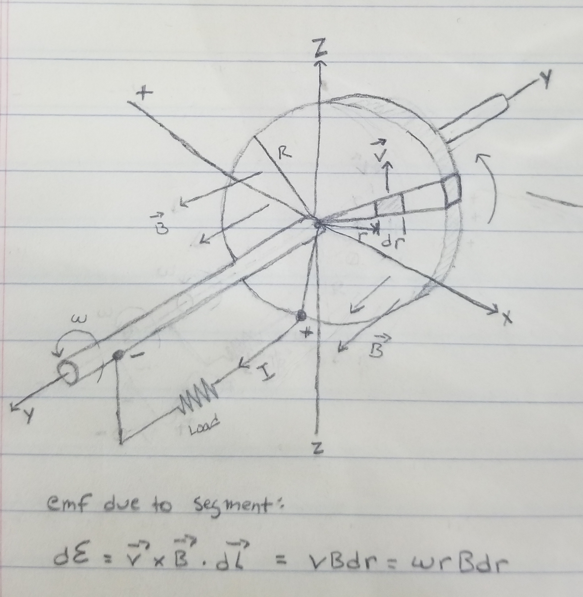
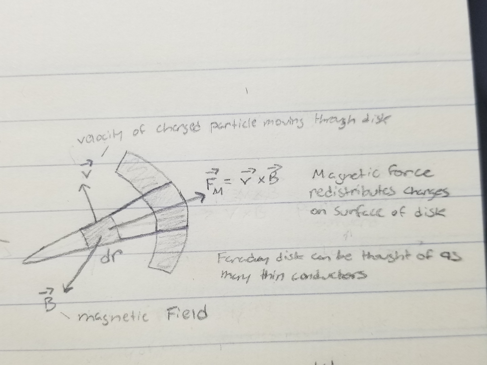

# Faraday Disk

## Introduction

A bit of a disclaimer, I barely know any physics. 
So, I probably got some terminology or calculations wrong.
This project was completed to learn more about electromagnetism.

The Faraday disk is an electrical generator that produces low voltage and high current.
It is unique since it is the only generator that produces true direct current without the need of rectifiers or commutators. But, it should be noted that the original design is an extremely inefficient generator.
The Faraday disk was first developed by Michael Faraday in 1831 during a series of experiments involving induction.

Searching around the internet for "Faraday disk" and "homopolar generator" will lead you to some strange pages on aether, free energy, and over unity. 
Without going into detail on some of the absurdity, I'm just going to say that I side with the beliefs of the last 100 years of physics and these three topics can be ignored.

## Physics

### Faraday's Law of Induction

In a Faraday disk, the magnetic field is static and the conductor is moved, this produces motional EMF.
The conductor is "cutting field lines" to induce EMF and current.

Faraday's Law of induction:

$$\epsilon=-\frac{d\Phi_B}{dt}$$
where
- $\epsilon$ is the induced electromotive force
- $\Phi_B$ is the magnetic flux

This direction (negative sign) is determined by Lenz's law.
Lenz's law states that the direction of induced EMF is such as to oppose the very cause producing it.

It turns out that Faraday's law is invalid for use with calculating induced EMF for the Faraday disk.
Instead, we need to use a derivation of the Maxwell-Faraday equation to determine motional EMF.

### Lorentz Force

The Lorentz force is used to describe the force experienced by a charged particle when moving through an electromagnetic field.
This can be calculated with the following formula:

$$\vec{F} = q(\vec{E} + \vec{v}\times \vec{B})$$
where
- $q$ is the charge of the particle
- $\vec{E}$ is the external electric field
- $\vec{v}$ is the velocity of the particle
- $\vec{B}$ is the external magnetic field

The charge of an electron is equal to $-1.602\times10^{-19}\text{ coulombs}$.

The Lorentz force is responsible for the generation of electrical current in the Faraday disk.
This in turn produces electromagnetic forces within the disk that produces a counter or back torque that opposes rotation.

### Maxwell-Faraday Equation

The Maxwell-Faraday equation is used to generalize Faraday's law and it solves the problem
mentioned earlier when Faraday's law fails during motional EMF of the Faraday disk.

$$\nabla\times\vec{E}=-\frac{\partial{\vec{B}}}{\partial t}$$
where
- $\vec{E}$ is the electric field
- $\vec{B}$ is the magnetic field
- $\nabla\times$ is the curl operator

 

Or in the integral form using Kelvin-Stokes theorem:

$$\oint_C\vec{E}\cdot\vec{dl} = -\frac{d}{dt}\iint_S \vec{B}\cdot\vec{dA}$$
where
- $C$ is a closed loop
- $\vec{E}$ is the electric field
- $\vec{dl}$ is the infinitesimal vector element along path of integration $C$
- $S$ is the closed surface bounded by loop $C$
- $\vec{B}$ is the magnetic field
- $\vec{dA}$ is the infinitesimal vector element of area on surface $S$

 

The Maxwell-Faraday equation is basically used to describe how changing magnetic fields
induce electric fields and how electric fields circulate around closed loops 
due to the magnetic field changes.

### Induced EMF in Faraday Disk

Given the integral form of Maxwell-Faraday equation,

$$\oint_C\vec{E}\cdot\vec{dl}=-\frac{d}{dt}\iint_S\vec{B}\cdot\vec{dA}$$

Since the Faraday disk is the case of a conductor moving through a magnetic field, 
the equation can be simplified for a general case of motional EMF:

$$\epsilon=\oint_C(\vec{v}\times\vec{B})\cdot\vec{dl}$$

Since we're only interested in the EMF due to the Lorentz force from the center of the disk
to the edge of the disk, the motional EMF equation can be simplified to:

$$\epsilon=\oint_C(\vec{v}\times\vec{B})\cdot\vec{dl}
=\int_0^R(\vec{v}\times\vec{B})\cdot\vec{dl}$$
where
- $\epsilon$ is the induced electromotive force (EMF)
- $C$ is the path of the circuit, between center 0 and rim $R$ of disk
- $\vec{v}$ is the velocity of conductor element
- $\vec{B}$ is the magnetic field at position of conductor element
- $\vec{dl}$ is a small vector element across path of integration on conductor, pointing in direction of path $C$

We integrate from 0 to $R$ since only part of the disk is non-parallel to $\vec{B}$ at a given point in time.

Notice that $\vec{v}\times\vec{B}$ is the magnetic portion of the Lorentz force, since the Faraday disk
is rotating in a static magnetic field.

Given the induced EMF caused by a segment of the disk, $d\epsilon$:

$$d\epsilon = (\vec{v}\times\vec{B})\cdot\vec{dl}=vBdr=\omega rBdr$$
where
- $dr$ is a slice of a radial segment of the disk
- $\omega$ is the angular velocity of the charged particle
- $\omega=vr$
- $r$ is the distance from the center of the disk

The EMF equation above can now be simplified to:

$$\epsilon=\int_0^R(\vec{v}\times\vec{B})\cdot\vec{dl}
=\int_0^R(\omega Br)\ dr
=wB\int_0^Rr\ dr
=wB(\frac{r^2}{2})\ \Big|_0^R
=\frac{1}{2}\omega BR^2$$

### Eddy Currents

In theory the Faraday disk has low potential difference and large current flow. However, the current is not competely radial
due to the static magnetic field not passing the entire surface of the disk. 
This produces Eddy currents that oppose the current produced due to the changing magnetic field.

Eddy currents are circular currents induced in a conductor when it is exposed to a changing magnetic field.

In other words, the magnets are only covering a segment of the disk, 
so the Eddy currents oppose a majority of the current produced directly under the magnets.
If the generator was redesigned to have a static magnetic field across the entire disk, there should be less current loss and less of an opposition to rotation.

The magnitude of an eddy current can be calculated using Faraday's second law of magnetic induction: $$I=-\frac{1}{R}\frac{d\Phi_B}{dt}$$

where
- $R$ is the resistance of the conductor
- $\Phi_B$ is the magnetic flux supplied throughout the conductor

The direction is determined from Lenz's Law or Fleming's right hand rule.
The Lorentz force is responsible for driving the motion of electrons that make up eddy currents.

This is the same concept that is used in electromagnetic braking and why it is so difficult to turn the disk.

### Faraday Paradox

In an alternate configuration of the Faraday disk, often called the "One-piece Faraday generator", the magnet rotates with the disk. 
It seems unintuitive at first, but this still generates voltage even though it seems as though the magnetic field lines are no longer being cut.
Faraday's law seems to predict that this configuration would produce zero EMF, but there is non-zero EMF.
So, the confusion comes from whether or not the magnetic field lines are stationary or rotate.
This is my basic understanding/explanation of the Faraday paradox in relation to the Faraday disk.

The Faraday paradox was reconciled by Einstein's paper on special relativity.
I'm too dumb to understand at the moment, but reading the following may prove helpful:

- [references/unipolar-induction-messy.pdf](references/unipolar-induction-messy.pdf)
- https://en.wikipedia.org/wiki/Moving_magnet_and_conductor_problem
- https://en.wikipedia.org/wiki/Classical_electromagnetism_and_special_relativity

## Actual Performance

Measurements:

- Disk inner radius - 12.7mm
- Disk outer radius - 150mm
- Disk thickness - 1.5mm
- Disk resistance - 0.5 $\Omega$
- Magnetic flux density - 120mT
- RPM - ~200 (counter-clockwise)
- Voltage - ~1.9-2.1mV
- Current - ~0.1 $\mu\text{A}$

RPM was measured by manually counting 50 rotations of hand crank in a minute.
Then, multiplying by gear ratio $50(4)=200$.

## Theoretical Performance

Given
- Disk radius $R=150\text{mm}$
- Magnetic flux density $B=120\text{mT}$
- Angular velocity $\omega=200\text{rpm}$

In SI units:
- $R=150\text{mm}=0.15\text{m}$
- $B=120\text{mT}=0.12\text{T}$
- $\omega=200\text{ rpm} = \frac{200}{60}2\pi=20.94\text{ rad/s}$

Using equation for induced EMF in a Faraday disk:

$$\epsilon=\frac{1}{2}\omega BR^2$$
$$\epsilon=\frac{1}{2}(20.94\text{ rad/s})(0.12\text{ T})(0.15\text{ m})
=0.18\text{ V} = 180\text{ mV}$$

To find theoretical resistance of disk, use equation for resistance of cylindrical conductor
and resistivity of copper $1.724\times 10^{-8}\frac{\Omega}{\text{m}}$

$$R=\frac{\rho L}{A}
=1.724\times 10^{-8}\cdot\frac{0.015}{\pi 0.15^2}
=0.2248\Omega$$
where
- $\rho$ is the resistivity of the material
- $L$ is the length or thickness
- $A$ is the cross-sectional area, $A=\pi R^2$

Using Ohm's Law:

$$I=\frac{V}{R}
=\frac{0.18\text{ V}}{0.2248\Omega}
=0.8007\text{A}$$

## Potential Losses

There's a ton of things that could have went wrong with my design.

- Friction between 3D printed parts, axles, bearings, and brush contacts
- Material resistance of partially oxidized copper
- Lack of conductivity from brush contacts
- Back torque from Lorentz force and eddy currents

## Design

This probably won't be too detailed, but this section will have some notes about why the design is the way it is.

Originally, I planned on 3D printing a disk and wrapping it in a layer of aluminum foil to use as my conducting disk. 
After accidentally punching a hole in three of these disks I decided to buy actual conductive disks.
On Amazon, I managed to find copper and aluminum gem polishing disks to serve as my conductive disk.

The copper disk has an outer diameter of 150mm, inner diameter of 12.7mm, and thickness of 1.5mm. 
The disk was attached to the 6mm steel axle using 3D printed couplers, washers, and copper foil. 
The copper foil and washers were needed to provide continuity between the axle and the larger inner radius of the copper disk. 
This probably lead to unnecessary resistance in the circuit because of this design flaw.

I didn't know what magnets to get, so I found the strongest neodymium magnets easily purchased from Amazon.
These large neodymium magnets are 40x20mm and have roughly a magnetic flux density of 120mT.
The large neodymium magnets were placed as close to the disk as possible without cracking the 3D printed mounts and/or bending too far into the disk.
In hindsight, maybe these magnets were too strong for this design.

To potentially increase angular velocity or RPM, I decided to add a 1:4 gear ratio using 11 and 44 toothed spur gears. 
The basic formula for gear ratios is given by:

$$\frac{\text{driver RPM}}{\text{driven RPM}}
=\frac{\text{teeth driven}}{\text{teeth driver}}
=\frac{11}{44}
=1:4$$

Unfortunately, I believe this made transfer of torque from the hand crank worse.
Combined with the strong opposition from the magnets, it was very difficult to turn the generator and reach high RPM.

The copper disk also has a problem with oxidation. 
At the start of the project, the resistance between the disk and the axle was around $0.1 \Omega$, but over time rose to $0.5 \Omega$ because of the oxidation.
I would have used the aluminum disk, but had a lot of problems getting measureable current, maybe due to the increased thickness.
